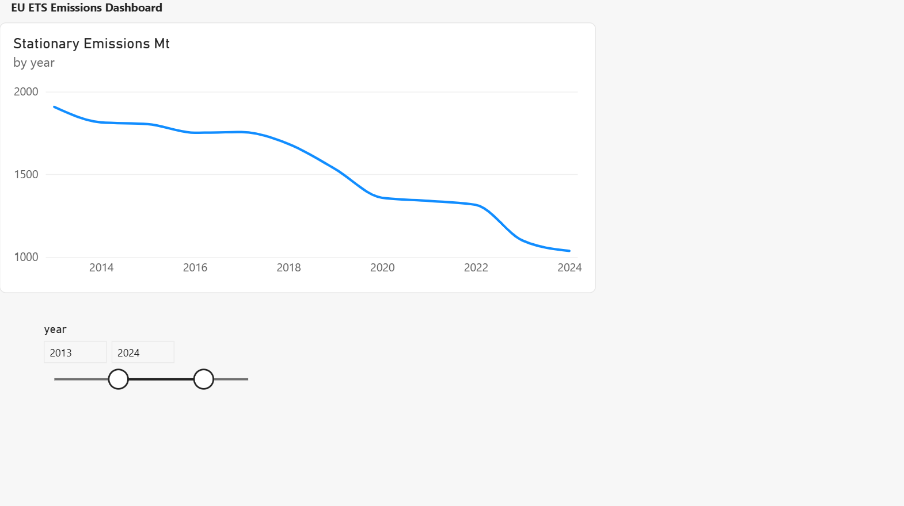
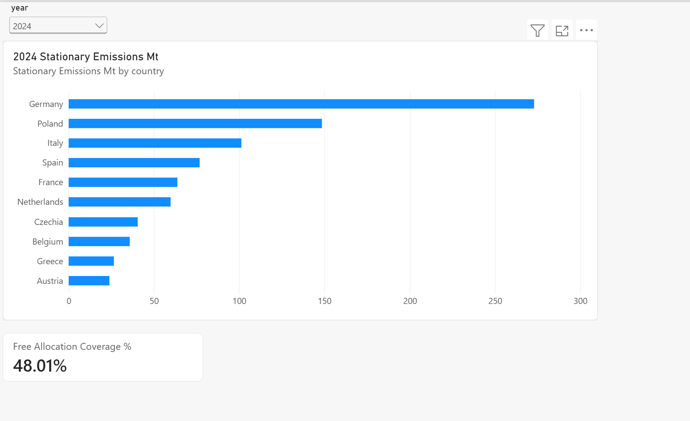
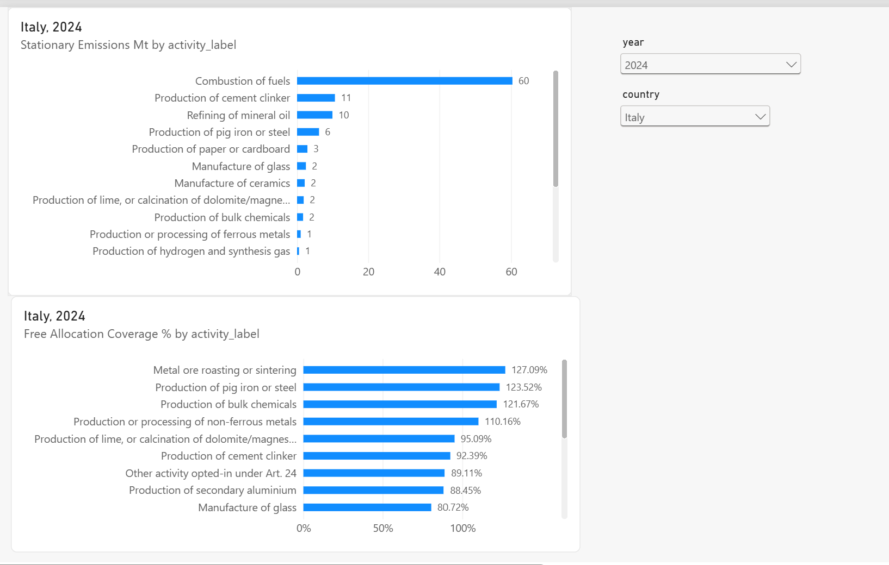

# EU ETS Emissions & Free Allocation Dashboard (Italy vs EU)

Power BI dashboard on verified emissions and free allocation of allowances under the EU Emissions Trading System (EU ETS), built from the European Environment Agency (EEA) EU ETS dataset (Union Registry extract, September 2026).

**Question:** how have stationary-installation emissions evolved since 2013, how does Italy compare with other large emitters, and how much of each sector's emissions is covered by free allowances?

## Key findings
- **EU trend:** verified emissions of stationary installations fell from ~1,908 Mt CO2e (2013) to ~1,034 Mt (2024), about -46%.
- **Country comparison (2024):** Germany (~273 Mt), Poland (~149 Mt) and Italy (~101 Mt) are the three largest emitters.
- **Free allocation coverage (2024):** across the EU, free allowances covered ~48% of stationary emissions (~496 Mt of ~1,034 Mt); in Italy ~43% (~43 Mt of ~101 Mt).
- **Italy by sector (2024):** combustion of fuels is the largest source (~60 Mt) but only ~10% of it is covered by free allocation. Coverage exceeds 100% in metal ore roasting (~127%), pig iron/steel (~124%) and bulk chemicals (~122%); cement clinker is ~92%.
- Coverage is a single-year ratio of allocated allowances to verified emissions. The data does not show how individual companies use any surplus.

## Dashboard pages
| Page | Content |
|---|---|
| Emissions Trend | EU stationary emissions 2013-2024, year-range slicer |
| Country Comparison 2024 | Top 10 emitters, EU free-allocation coverage |
| Italy by Sector | Emissions and free-allocation coverage by activity type, Italy 2024 |





## Data
- Source: EEA, *European Union Emissions Trading System (EU ETS) data from the Union Registry* (EEA datahub). Activity labels from the *EU ETS data viewer background note* (Table 6-1).
- Raw file is not redistributed here; download it from the EEA datahub and place it in `data/raw/`.

## Method
`src/clean_ets.py` (pandas):
1. Keep yearly rows only (drops trading-period totals).
2. Keep real countries (drops Innovation Fund, Modernisation Fund, RRF, NER 300).
3. Keep three metrics: verified emissions, free allocation, surrendered units.
4. Drop pre-aggregated activity codes (`20-99`, `21-99`) to avoid double counting.
5. Check: summing detailed stationary codes reproduces the EEA aggregate (2013: 1,907.9 Mt; 2024: 1,033.5 Mt).

Power BI model: star schema (`ets_fact` with `dim_country`, `dim_activity`). Main DAX measures:
```
Stationary Emissions Mt = CALCULATE(SUM(ets_fact[value_mt]), ets_fact[metric] = "verified_emissions",
    ets_fact[activity_code] <> 10, ets_fact[activity_code] <> 50)
Stationary Free Allocation Mt = CALCULATE(SUM(ets_fact[value_mt]), ets_fact[metric] = "free_allocation",
    ets_fact[activity_code] <> 10, ets_fact[activity_code] <> 50)
Free Allocation Coverage % = DIVIDE([Stationary Free Allocation Mt], [Stationary Emissions Mt])
```
Stationary scope excludes aviation (code 10) and maritime (code 50).

## Limitations
- 2025 is excluded: the latest year is reported with a gap-filled estimate and is not final.
- Installation-level (ETS) emissions are not company Scope 1-2-3 GHG inventories and do not follow the GHG Protocol corporate standard.
- Before 2013 the ETS scope was narrower; long-run comparisons across trading periods should use EEA's scope-adjusted estimates.
- Some old activity codes were mapped to new ones by EEA; code 99 (opt-in) is heterogeneous.

## Repo structure
```
data/raw/    (not included)   data/clean/  ets_fact.csv, dim_country.csv, dim_activity.csv
src/clean_ets.py              dashboard/   eu-ets-emissions-dashboard.pbix
images/                       README.md
```
